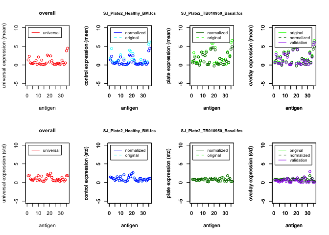

CytofIN testing
================

# Setup

``` r
library(devtools)
```

    ## Loading required package: usethis

``` r
library(usethis)
library(tidyverse)
```

    ## ── Attaching packages ─────────────────────────────────────── tidyverse 1.3.1 ──

    ## ✓ ggplot2 3.3.3     ✓ purrr   0.3.4
    ## ✓ tibble  3.1.0     ✓ dplyr   1.0.5
    ## ✓ tidyr   1.1.3     ✓ stringr 1.4.0
    ## ✓ readr   1.4.0     ✓ forcats 0.5.1

    ## ── Conflicts ────────────────────────────────────────── tidyverse_conflicts() ──
    ## x dplyr::filter() masks stats::filter()
    ## x dplyr::lag()    masks stats::lag()

# Installation

I noticed in your README.md file on your GitHub repo for this package
that you recommended installation using a nonstandard method
(downloading the source package from github manually via the command
line, then building the package locally using `devtools`). A slightly
more streamlined way to do this is simply use `devtools` to download the
package (and build it) directly from your GitHub repo, and this is what
I would recommend you tell readers to do:

``` r
install_github("bennyyclo/Cytofin")
```

Comments: This works, but I will note that installation takes a while -
way longer than I would expect. I think this is because you include a
decent amount of data inside the package in the form of .fcs files (in
`Cytofin/inst/extdata`). Maybe consider storing these data elsewhere -
one option is to do what [previous authors from our lab
did](https://github.com/kara-davis-lab/DDPR) and upload the files to
their own GitHub repo (this is not standard, but it works).

# Loading

``` r
library(cytofin)
```

# Documentation

Most R packages are documented not only on the function level, but also
on the whole-package level.

``` r
help(package = "cytofin")
```

From running this command, we can see that your `DESCRIPTION` file
(which should be at the root of your R package directory on your local
machine) doesn’t have the **Title** field filled in. I recommend filling
it in with *Homogenize and Integrate Heterogeneous Mass Cytometry Data
From Multiple Data Sets*.

We can also see that there are 4 functions in this R package:

-   `annorm()`: Normalize CyTOF data panel
-   `annorm_nrs()`: Normalize CyTOF data panel
-   `anprep()`: Prep CyTOF control for normalization
-   `homogenize()`: Homogenize CyTOF data panel

From skimming the help files of these functions (using
`?function_name`), I can see that there are a few issues with the
function documentation. One issue is that the parameters of each
function are not specified correctly (@parameter needs to be specified
on each line before the parameter name, and a text description for each
parameter should be provided after that). I use [this book
chapter](https://r-pkgs.org/man.html) to help me when I’m documenting
functions with `roxygen2`.

# NAMESPACE

I’ve noticed in your NAMESPACE files only include the following 4 lines:

> export(annorm) export(annorm\_nrs) export(anprep) export(homogenize)

Maybe the problem the reviewer had was because they were missing one of
the package imports? Check out [this
chapter](https://r-pkgs.org/namespace.html?q=import#imports) to make
sure you’re using the `@import` tag where you need to in your function
documentation.

# R CMD Check

I noticed that this packages doesn’t pass the R CMD Check. I’m still
trying to figure out why.

# Demo

## Homogenization

``` r
#homogenize antigen panel, using the demo data supplied with the package
metadata_filename <- 
  paste0(path.package("cytofin"),"/extdata/test_metadata_raw.csv")

panel_filename <- 
  paste0(path.package("cytofin"),"/extdata/test_panel.csv")

input_file_dir <- 
  paste0(path.package("cytofin"),"/extdata/test_raw_fcs_files/")

output_file_dir <- "out_test/"

homogenize(metadata_filename, panel_filename, input_file_dir, output_file_dir)
```

    ## Warning in dir.create(output_file_dir): 'out_test' already exists

    ##                             filename  cohort plate_number patient_id condition
    ## 1       ALL05v2_Plate2_UPN94 das.fcs ALL05v2       plate2      UPN94       Das
    ## 2       ALL08_Plate8_UPN26 basal.fcs   ALL08       plate8      UPN26     Basal
    ## 3  CRLF2_Plate1_UPN53 das + TSLP.fcs   CRLF2       plate1      UPN53  das_TSLP
    ## 4  ALL05v2_Plate2_healthy basal1.fcs ALL05v2       plate2    Healthy     Basal
    ## 5   ALL08_Plate8_Healthy03 basal.fcs   ALL08       plate8  Healthy03     Basal
    ## 6    CRLF2_Plate1_Healthy 04 BCR.fcs   CRLF2       plate1  Healthy04       BCR
    ## 7          MS_Plate5_SU978 Basal.fcs  MajSak       plate5      SU978     Basal
    ## 8           MS_Plate5_Healthy BM.fcs  MajSak       plate5    Healthy        BM
    ## 9       SJ_Plate2_TB010950_Basal.fcs  StJude       plate2   TB010950     Basal
    ## 10          SJ_Plate2_Healthy_BM.fcs  StJude       plate2    Healthy        BM
    ##    population                                    validation
    ## 1        <NA>      homogenized_ALL05v2_plate2_UPN94 das.fcs
    ## 2        <NA>      homogenized_ALL08_plate8_UPN26 basal.fcs
    ## 3        <NA> homogenized_CRLF2_plate1_UPN53 das + TSLP.fcs
    ## 4           1 homogenized_ALL05v2_plate2_healthy basal1.fcs
    ## 5        <NA>  homogenized_ALL08_plate9_Healthy03 basal.fcs
    ## 6        <NA>   homogenized_CRLF2_plate1_Healthy 04 BCR.fcs
    ## 7        <NA>     homogenized_MajSak_plate5_SU978 Basal.fcs
    ## 8        <NA>      homogenized_MajSak_plate5_Healthy BM.fcs
    ## 9        <NA>  homogenized_StJude_plate2_TB010950_Basal.fcs
    ## 10       <NA>      homogenized_StJude_plate2_Healthy_BM.fcs
    ##            desc        range metal_pattern antigen_pattern Lineage Functional
    ## 1          Time         Time       [Tt]ime         [Tt]ime       0          0
    ## 2  Event_length Event_length         ength           ength       0          0
    ## 3     (Pd102)Di          BC1         Pd102             BC1       0          0
    ## 4     (Pd104)Di          BC2         Pd104             BC2       0          0
    ## 5     (Pd105)Di          BC3         Pd105             BC3       0          0
    ## 6     (Pd106)Di          BC4         Pd106             BC4       0          0
    ## 7     (Pd108)Di          BC5         Pd108             BC5       0          0
    ## 8     (Pd110)Di          BC6         Pd110             BC6       0          0
    ## 9     (In113)Di   CD235_CD61         In113           CD235       1          0
    ## 10    (In115)Di         CD45         In115            CD45       1          0
    ## 11    (La139)Di        cPARP         La139            PARP       0          1
    ## 12    (Pr141)Di     pPLCg1_2         Pr141        pPLCg1_2       0          1
    ## 13    (Nd142)Di         CD19         Nd142            CD19       1          0
    ## 14    (Nd143)Di         CD22         Nd143            CD22       1          0
    ## 15    (Nd144)Di       p4EBP1         Nd144          p4EBP1       0          1
    ## 16    (Nd145)Di      tIkaros         Nd145         tIkaros       1          0
    ## 17    (Nd146)Di        CD79b         Nd146           CD79b       1          0
    ## 18    (Sm147)Di         CD20      [PS]m147            CD20       1          0
    ## 19    (Nd148)Di         CD34         Nd148            CD34       1          0
    ## 20    (Sm149)Di       CD179a         Sm149          CD179a       1          0
    ## 21    (Nd150)Di       pSTAT5         Nd150          pSTAT5       0          1
    ## 22    (Sm152)Di         Ki67         Sm152            Ki67       0          1
    ## 23    (Eu153)Di         IgMi         Eu153            IgMi       1          0
    ## 24    (Sm154)Di Kappa_lambda         Sm154            appa       0          1
    ## 25    (Gd156)Di         CD10         Gd156            CD10       1          0
    ## 26    (Gd158)Di       CD179b         Gd158          CD179b       1          0
    ## 27    (Gd160)Di         CD24         Gd160            CD24       1          0
    ## 28    (Dy161)Di        TSLPr         Dy161           TSLPr       0          1
    ## 29    (Dy162)Di        CD127         Dy162           CD127       1          0
    ## 30    (Dy163)Di         RAG1         Dy163            RAG1       1          0
    ## 31    (Dy164)Di          TdT         Dy164              Td       1          0
    ## 32    (Ho165)Di         Pax5         Ho165            Pax5       1          0
    ## 33    (Er166)Di         pSyk         Er166            pSyk       0          1
    ## 34    (Er167)Di         CD43         Er167            CD43       1          0
    ## 35    (Er168)Di         CD38         Er168            CD38       1          0
    ## 36    (Er170)Di          CD3         Er170            CD3^       1          0
    ## 37    (Yb171)Di         CD33         Yb171       FITC|CD33       0          1
    ## 38    (Yb172)Di          pS6         Yb172             pS6       0          1
    ## 39    (Yb173)Di         pErk         Yb173            pErk       0          1
    ## 40    (Yb174)Di        HLADR         Yb174           HLADR       1          0
    ## 41    (Lu175)Di         IgMs         Lu175            IgMs       1          0
    ## 42    (Yb176)Di        pCreb     [YbLu]176           pCreb       0          1
    ## 43    (Ir191)Di         DNA1         Ir191            DNA1       0          1
    ## 44    (Ir193)Di         DNA2         Ir193            DNA2       0          1
    ##    General
    ## 1        1
    ## 2        1
    ## 3        1
    ## 4        1
    ## 5        1
    ## 6        1
    ## 7        1
    ## 8        1
    ## 9        0
    ## 10       0
    ## 11       0
    ## 12       0
    ## 13       0
    ## 14       0
    ## 15       0
    ## 16       0
    ## 17       0
    ## 18       0
    ## 19       0
    ## 20       0
    ## 21       0
    ## 22       0
    ## 23       0
    ## 24       0
    ## 25       0
    ## 26       0
    ## 27       0
    ## 28       0
    ## 29       0
    ## 30       0
    ## 31       0
    ## 32       0
    ## 33       0
    ## 34       0
    ## 35       0
    ## 36       0
    ## 37       0
    ## 38       0
    ## 39       0
    ## 40       0
    ## 41       0
    ## 42       0
    ## 43       0
    ## 44       0
    ## uneven number of tokens: 529
    ## The last keyword is dropped.
    ## uneven number of tokens: 529
    ## The last keyword is dropped.
    ## filename: ALL05v2_Plate2_UPN94 das.fcs 
    ## 1 
    ## matched data_antigen: Time ref_antigen: Time ref_antigen_pattern [Tt]ime 
    ## 2 
    ## matched data_antigen: Event_length ref_antigen: Event_length ref_antigen_pattern ength 
    ## 3 
    ## matched data_antigen: BC1 ref_antigen: BC1 ref_antigen_pattern BC1 
    ## 4 
    ## matched data_antigen: BC2 ref_antigen: BC2 ref_antigen_pattern BC2 
    ## 5 
    ## matched data_antigen: BC3 ref_antigen: BC3 ref_antigen_pattern BC3 
    ## 6 
    ## matched data_antigen: BC4 ref_antigen: BC4 ref_antigen_pattern BC4 
    ## 7 
    ## matched data_antigen: BC5 ref_antigen: BC5 ref_antigen_pattern BC5 
    ## 8 
    ## matched data_antigen: BC6 ref_antigen: BC6 ref_antigen_pattern BC6 
    ## 9 
    ## matched data_antigen: CD235_CD61 ref_antigen: CD235_CD61 ref_antigen_pattern CD235 
    ## 10 
    ## matched data_antigen: CD45 ref_antigen: CD45 ref_antigen_pattern CD45 
    ## 11 
    ## matched data_antigen: cPARP ref_antigen: cPARP ref_antigen_pattern PARP 
    ## 12 
    ## matched data_antigen: pPLCg1_2 ref_antigen: pPLCg1_2 ref_antigen_pattern pPLCg1_2 
    ## 13 
    ## matched data_antigen: CD19 ref_antigen: CD19 ref_antigen_pattern CD19 
    ## 14 
    ## matched data_antigen: CD22 ref_antigen: CD22 ref_antigen_pattern CD22 
    ## 15 
    ## matched data_antigen: p4EBP1 ref_antigen: p4EBP1 ref_antigen_pattern p4EBP1 
    ## 16 
    ## matched data_antigen: tIkaros ref_antigen: tIkaros ref_antigen_pattern tIkaros 
    ## 17 
    ## matched data_antigen: CD79b ref_antigen: CD79b ref_antigen_pattern CD79b 
    ## 18 
    ## matched data_antigen: CD20 ref_antigen: CD20 ref_antigen_pattern CD20 
    ## 19 
    ## matched data_antigen: CD34 ref_antigen: CD34 ref_antigen_pattern CD34 
    ## 20 
    ## matched data_antigen: CD179a ref_antigen: CD179a ref_antigen_pattern CD179a 
    ## 21 
    ## matched data_antigen: pSTAT5 ref_antigen: pSTAT5 ref_antigen_pattern pSTAT5 
    ## 22 
    ## matched data_antigen: Ki67 ref_antigen: Ki67 ref_antigen_pattern Ki67 
    ## 23 
    ## matched data_antigen: IgMi ref_antigen: IgMi ref_antigen_pattern IgMi 
    ## 24 
    ## matched data_antigen: Kappa_lambda ref_antigen: Kappa_lambda ref_antigen_pattern appa 
    ## 25 
    ## matched data_antigen: CD10 ref_antigen: CD10 ref_antigen_pattern CD10 
    ## 26 
    ## matched data_antigen: CD179b ref_antigen: CD179b ref_antigen_pattern CD179b 
    ## 27 
    ## matched data_antigen: CD24 ref_antigen: CD24 ref_antigen_pattern CD24 
    ## 28 
    ## matched data_antigen: TSLPr ref_antigen: TSLPr ref_antigen_pattern TSLPr 
    ## 29 
    ## matched data_antigen: CD127 ref_antigen: CD127 ref_antigen_pattern CD127 
    ## 30 
    ## matched data_antigen: RAG1 ref_antigen: RAG1 ref_antigen_pattern RAG1 
    ## 31 
    ## matched data_antigen: TdT ref_antigen: TdT ref_antigen_pattern Td 
    ## 32 
    ## matched data_antigen: Pax5 ref_antigen: Pax5 ref_antigen_pattern Pax5 
    ## 33 
    ## matched data_antigen: pSyk ref_antigen: pSyk ref_antigen_pattern pSyk 
    ## 34 
    ## matched data_antigen: CD43 ref_antigen: CD43 ref_antigen_pattern CD43 
    ## 35 
    ## matched data_antigen: CD38 ref_antigen: CD38 ref_antigen_pattern CD38 
    ## 36 
    ## matched data_antigen:  ref_antigen: CD3 ref_antigen_pattern CD3^ 
    ## 37 
    ## matched data_antigen: FITC_myeloid ref_antigen: CD33 ref_antigen_pattern FITC|CD33 
    ## 38 
    ## matched data_antigen: pS6 ref_antigen: pS6 ref_antigen_pattern pS6 
    ## 39 
    ## matched data_antigen: pErk ref_antigen: pErk ref_antigen_pattern pErk 
    ## 40 
    ## matched data_antigen: HLADR ref_antigen: HLADR ref_antigen_pattern HLADR 
    ## 41 
    ## matched data_antigen: IgMs ref_antigen: IgMs ref_antigen_pattern IgMs 
    ## 42 
    ## matched data_antigen: pCreb ref_antigen: pCreb ref_antigen_pattern pCreb 
    ## 43 
    ## matched data_antigen: DNA1 ref_antigen: DNA1 ref_antigen_pattern DNA1 
    ## 44 
    ## matched data_antigen: DNA2 ref_antigen: DNA2 ref_antigen_pattern DNA2 
    ## uneven number of tokens: 529
    ## The last keyword is dropped.
    ## uneven number of tokens: 529
    ## The last keyword is dropped.
    ## filename: ALL08_Plate8_UPN26 basal.fcs 
    ## 1 
    ## matched data_antigen: Time ref_antigen: Time ref_antigen_pattern [Tt]ime 
    ## 2 
    ## matched data_antigen: Event_length ref_antigen: Event_length ref_antigen_pattern ength 
    ## 3 
    ## matched data_antigen: BC1 ref_antigen: BC1 ref_antigen_pattern BC1 
    ## 4 
    ## matched data_antigen: BC2 ref_antigen: BC2 ref_antigen_pattern BC2 
    ## 5 
    ## matched data_antigen: BC3 ref_antigen: BC3 ref_antigen_pattern BC3 
    ## 6 
    ## matched data_antigen: BC4 ref_antigen: BC4 ref_antigen_pattern BC4 
    ## 7 
    ## matched data_antigen: BC5 ref_antigen: BC5 ref_antigen_pattern BC5 
    ## 8 
    ## matched data_antigen: BC6 ref_antigen: BC6 ref_antigen_pattern BC6 
    ## 9 
    ## matched data_antigen: CD235_CD61 ref_antigen: CD235_CD61 ref_antigen_pattern CD235 
    ## 10 
    ## matched data_antigen: CD45 ref_antigen: CD45 ref_antigen_pattern CD45 
    ## 11 
    ## matched data_antigen: cPARP ref_antigen: cPARP ref_antigen_pattern PARP 
    ## 12 
    ## matched data_antigen: pPLCg1_2 ref_antigen: pPLCg1_2 ref_antigen_pattern pPLCg1_2 
    ## 13 
    ## matched data_antigen: CD19 ref_antigen: CD19 ref_antigen_pattern CD19 
    ## 14 
    ## matched data_antigen: CD22 ref_antigen: CD22 ref_antigen_pattern CD22 
    ## 15 
    ## matched data_antigen: p4EBP1 ref_antigen: p4EBP1 ref_antigen_pattern p4EBP1 
    ## 16 
    ## matched data_antigen: tIkaros ref_antigen: tIkaros ref_antigen_pattern tIkaros 
    ## 17 
    ## matched data_antigen: CD79b ref_antigen: CD79b ref_antigen_pattern CD79b 
    ## 18 
    ## matched data_antigen: CD20 ref_antigen: CD20 ref_antigen_pattern CD20 
    ## 19 
    ## matched data_antigen: CD34 ref_antigen: CD34 ref_antigen_pattern CD34 
    ## 20 
    ## matched data_antigen: CD179a ref_antigen: CD179a ref_antigen_pattern CD179a 
    ## 21 
    ## matched data_antigen: pSTAT5 ref_antigen: pSTAT5 ref_antigen_pattern pSTAT5 
    ## 22 
    ## matched data_antigen: Ki67 ref_antigen: Ki67 ref_antigen_pattern Ki67 
    ## 23 
    ## matched data_antigen: IgMi ref_antigen: IgMi ref_antigen_pattern IgMi 
    ## 24 
    ## matched data_antigen: Kappa_lambda ref_antigen: Kappa_lambda ref_antigen_pattern appa 
    ## 25 
    ## matched data_antigen: CD10 ref_antigen: CD10 ref_antigen_pattern CD10 
    ## 26 
    ## matched data_antigen: CD179b ref_antigen: CD179b ref_antigen_pattern CD179b 
    ## 27 
    ## matched data_antigen: CD24 ref_antigen: CD24 ref_antigen_pattern CD24 
    ## 28 
    ## matched data_antigen: TSLPr ref_antigen: TSLPr ref_antigen_pattern TSLPr 
    ## 29 
    ## matched data_antigen: CD127 ref_antigen: CD127 ref_antigen_pattern CD127 
    ## 30 
    ## matched data_antigen: RAG1 ref_antigen: RAG1 ref_antigen_pattern RAG1 
    ## 31 
    ## matched data_antigen: TdT ref_antigen: TdT ref_antigen_pattern Td 
    ## 32 
    ## matched data_antigen: Pax5 ref_antigen: Pax5 ref_antigen_pattern Pax5 
    ## 33 
    ## matched data_antigen: pSyk ref_antigen: pSyk ref_antigen_pattern pSyk 
    ## 34 
    ## matched data_antigen: CD43 ref_antigen: CD43 ref_antigen_pattern CD43 
    ## 35 
    ## matched data_antigen: CD38 ref_antigen: CD38 ref_antigen_pattern CD38 
    ## 36 
    ## matched data_antigen:  ref_antigen: CD3 ref_antigen_pattern CD3^ 
    ## 37 
    ## matched data_antigen: FITC_myeloid ref_antigen: CD33 ref_antigen_pattern FITC|CD33 
    ## 38 
    ## matched data_antigen: pS6 ref_antigen: pS6 ref_antigen_pattern pS6 
    ## 39 
    ## matched data_antigen: pErk ref_antigen: pErk ref_antigen_pattern pErk 
    ## 40 
    ## matched data_antigen: HLADR ref_antigen: HLADR ref_antigen_pattern HLADR 
    ## 41 
    ## matched data_antigen: IgMs ref_antigen: IgMs ref_antigen_pattern IgMs 
    ## 42 
    ## matched data_antigen: pCreb ref_antigen: pCreb ref_antigen_pattern pCreb 
    ## 43 
    ## matched data_antigen: DNA1 ref_antigen: DNA1 ref_antigen_pattern DNA1 
    ## 44 
    ## matched data_antigen: DNA2 ref_antigen: DNA2 ref_antigen_pattern DNA2 
    ## uneven number of tokens: 529
    ## The last keyword is dropped.
    ## uneven number of tokens: 529
    ## The last keyword is dropped.
    ## filename: CRLF2_Plate1_UPN53 das + TSLP.fcs 
    ## 1 
    ## matched data_antigen: Time ref_antigen: Time ref_antigen_pattern [Tt]ime 
    ## 2 
    ## matched data_antigen: Event_length ref_antigen: Event_length ref_antigen_pattern ength 
    ## 3 
    ## matched data_antigen: BC1 ref_antigen: BC1 ref_antigen_pattern BC1 
    ## 4 
    ## matched data_antigen: BC2 ref_antigen: BC2 ref_antigen_pattern BC2 
    ## 5 
    ## matched data_antigen: BC3 ref_antigen: BC3 ref_antigen_pattern BC3 
    ## 6 
    ## matched data_antigen: BC4 ref_antigen: BC4 ref_antigen_pattern BC4 
    ## 7 
    ## matched data_antigen: BC5 ref_antigen: BC5 ref_antigen_pattern BC5 
    ## 8 
    ## matched data_antigen: BC6 ref_antigen: BC6 ref_antigen_pattern BC6 
    ## 9 
    ## matched data_antigen: CD235_CD61 ref_antigen: CD235_CD61 ref_antigen_pattern CD235 
    ## 10 
    ## matched data_antigen: CD45 ref_antigen: CD45 ref_antigen_pattern CD45 
    ## 11 
    ## matched data_antigen: cPARP ref_antigen: cPARP ref_antigen_pattern PARP 
    ## 12 
    ## matched data_antigen: pPLCg1_2 ref_antigen: pPLCg1_2 ref_antigen_pattern pPLCg1_2 
    ## 13 
    ## matched data_antigen: CD19 ref_antigen: CD19 ref_antigen_pattern CD19 
    ## 14 
    ## matched data_antigen: CD22 ref_antigen: CD22 ref_antigen_pattern CD22 
    ## 15 
    ## matched data_antigen: p4EBP1 ref_antigen: p4EBP1 ref_antigen_pattern p4EBP1 
    ## 16 
    ## matched data_antigen: tIkaros ref_antigen: tIkaros ref_antigen_pattern tIkaros 
    ## 17 
    ## matched data_antigen: CD79b ref_antigen: CD79b ref_antigen_pattern CD79b 
    ## 18 
    ## matched data_antigen: CD20 ref_antigen: CD20 ref_antigen_pattern CD20 
    ## 19 
    ## matched data_antigen: CD34 ref_antigen: CD34 ref_antigen_pattern CD34 
    ## 20 
    ## matched data_antigen: CD179a ref_antigen: CD179a ref_antigen_pattern CD179a 
    ## 21 
    ## matched data_antigen: pSTAT5 ref_antigen: pSTAT5 ref_antigen_pattern pSTAT5 
    ## 22 
    ## matched data_antigen: Ki67 ref_antigen: Ki67 ref_antigen_pattern Ki67 
    ## 23 
    ## matched data_antigen: IgMi ref_antigen: IgMi ref_antigen_pattern IgMi 
    ## 24 
    ## matched data_antigen: Kappa_lambda ref_antigen: Kappa_lambda ref_antigen_pattern appa 
    ## 25 
    ## matched data_antigen: CD10 ref_antigen: CD10 ref_antigen_pattern CD10 
    ## 26 
    ## matched data_antigen: CD179b ref_antigen: CD179b ref_antigen_pattern CD179b 
    ## 27 
    ## matched data_antigen: CD24 ref_antigen: CD24 ref_antigen_pattern CD24 
    ## 28 
    ## matched data_antigen: TSLPr ref_antigen: TSLPr ref_antigen_pattern TSLPr 
    ## 29 
    ## matched data_antigen: CD127 ref_antigen: CD127 ref_antigen_pattern CD127 
    ## 30 
    ## matched data_antigen: RAG1 ref_antigen: RAG1 ref_antigen_pattern RAG1 
    ## 31 
    ## matched data_antigen: TdT ref_antigen: TdT ref_antigen_pattern Td 
    ## 32 
    ## matched data_antigen: Pax5 ref_antigen: Pax5 ref_antigen_pattern Pax5 
    ## 33 
    ## matched data_antigen: pSyk ref_antigen: pSyk ref_antigen_pattern pSyk 
    ## 34 
    ## matched data_antigen: CD43 ref_antigen: CD43 ref_antigen_pattern CD43 
    ## 35 
    ## matched data_antigen: CD38 ref_antigen: CD38 ref_antigen_pattern CD38 
    ## 36 
    ## matched data_antigen:  ref_antigen: CD3 ref_antigen_pattern CD3^ 
    ## 37 
    ## matched data_antigen: FITC_myeloid ref_antigen: CD33 ref_antigen_pattern FITC|CD33 
    ## 38 
    ## matched data_antigen: pS6 ref_antigen: pS6 ref_antigen_pattern pS6 
    ## 39 
    ## matched data_antigen: pErk ref_antigen: pErk ref_antigen_pattern pErk 
    ## 40 
    ## matched data_antigen: HLADR ref_antigen: HLADR ref_antigen_pattern HLADR 
    ## 41 
    ## matched data_antigen: IgMs ref_antigen: IgMs ref_antigen_pattern IgMs 
    ## 42 
    ## matched data_antigen: pCreb ref_antigen: pCreb ref_antigen_pattern pCreb 
    ## 43 
    ## matched data_antigen: DNA1 ref_antigen: DNA1 ref_antigen_pattern DNA1 
    ## 44 
    ## matched data_antigen: DNA2 ref_antigen: DNA2 ref_antigen_pattern DNA2 
    ## uneven number of tokens: 529
    ## The last keyword is dropped.
    ## uneven number of tokens: 529
    ## The last keyword is dropped.
    ## filename: ALL05v2_Plate2_healthy basal1.fcs 
    ## 1 
    ## matched data_antigen: Time ref_antigen: Time ref_antigen_pattern [Tt]ime 
    ## 2 
    ## matched data_antigen: Event_length ref_antigen: Event_length ref_antigen_pattern ength 
    ## 3 
    ## matched data_antigen: BC1 ref_antigen: BC1 ref_antigen_pattern BC1 
    ## 4 
    ## matched data_antigen: BC2 ref_antigen: BC2 ref_antigen_pattern BC2 
    ## 5 
    ## matched data_antigen: BC3 ref_antigen: BC3 ref_antigen_pattern BC3 
    ## 6 
    ## matched data_antigen: BC4 ref_antigen: BC4 ref_antigen_pattern BC4 
    ## 7 
    ## matched data_antigen: BC5 ref_antigen: BC5 ref_antigen_pattern BC5 
    ## 8 
    ## matched data_antigen: BC6 ref_antigen: BC6 ref_antigen_pattern BC6 
    ## 9 
    ## matched data_antigen: CD235_CD61 ref_antigen: CD235_CD61 ref_antigen_pattern CD235 
    ## 10 
    ## matched data_antigen: CD45 ref_antigen: CD45 ref_antigen_pattern CD45 
    ## 11 
    ## matched data_antigen: cPARP ref_antigen: cPARP ref_antigen_pattern PARP 
    ## 12 
    ## matched data_antigen: pPLCg1_2 ref_antigen: pPLCg1_2 ref_antigen_pattern pPLCg1_2 
    ## 13 
    ## matched data_antigen: CD19 ref_antigen: CD19 ref_antigen_pattern CD19 
    ## 14 
    ## matched data_antigen: CD22 ref_antigen: CD22 ref_antigen_pattern CD22 
    ## 15 
    ## matched data_antigen: p4EBP1 ref_antigen: p4EBP1 ref_antigen_pattern p4EBP1 
    ## 16 
    ## matched data_antigen: tIkaros ref_antigen: tIkaros ref_antigen_pattern tIkaros 
    ## 17 
    ## matched data_antigen: CD79b ref_antigen: CD79b ref_antigen_pattern CD79b 
    ## 18 
    ## matched data_antigen: CD20 ref_antigen: CD20 ref_antigen_pattern CD20 
    ## 19 
    ## matched data_antigen: CD34 ref_antigen: CD34 ref_antigen_pattern CD34 
    ## 20 
    ## matched data_antigen: CD179a ref_antigen: CD179a ref_antigen_pattern CD179a 
    ## 21 
    ## matched data_antigen: pSTAT5 ref_antigen: pSTAT5 ref_antigen_pattern pSTAT5 
    ## 22 
    ## matched data_antigen: Ki67 ref_antigen: Ki67 ref_antigen_pattern Ki67 
    ## 23 
    ## matched data_antigen: IgMi ref_antigen: IgMi ref_antigen_pattern IgMi 
    ## 24 
    ## matched data_antigen: Kappa_lambda ref_antigen: Kappa_lambda ref_antigen_pattern appa 
    ## 25 
    ## matched data_antigen: CD10 ref_antigen: CD10 ref_antigen_pattern CD10 
    ## 26 
    ## matched data_antigen: CD179b ref_antigen: CD179b ref_antigen_pattern CD179b 
    ## 27 
    ## matched data_antigen: CD24 ref_antigen: CD24 ref_antigen_pattern CD24 
    ## 28 
    ## matched data_antigen: TSLPr ref_antigen: TSLPr ref_antigen_pattern TSLPr 
    ## 29 
    ## matched data_antigen: CD127 ref_antigen: CD127 ref_antigen_pattern CD127 
    ## 30 
    ## matched data_antigen: RAG1 ref_antigen: RAG1 ref_antigen_pattern RAG1 
    ## 31 
    ## matched data_antigen: TdT ref_antigen: TdT ref_antigen_pattern Td 
    ## 32 
    ## matched data_antigen: Pax5 ref_antigen: Pax5 ref_antigen_pattern Pax5 
    ## 33 
    ## matched data_antigen: pSyk ref_antigen: pSyk ref_antigen_pattern pSyk 
    ## 34 
    ## matched data_antigen: CD43 ref_antigen: CD43 ref_antigen_pattern CD43 
    ## 35 
    ## matched data_antigen: CD38 ref_antigen: CD38 ref_antigen_pattern CD38 
    ## 36 
    ## matched data_antigen:  ref_antigen: CD3 ref_antigen_pattern CD3^ 
    ## 37 
    ## matched data_antigen: FITC_myeloid ref_antigen: CD33 ref_antigen_pattern FITC|CD33 
    ## 38 
    ## matched data_antigen: pS6 ref_antigen: pS6 ref_antigen_pattern pS6 
    ## 39 
    ## matched data_antigen: pErk ref_antigen: pErk ref_antigen_pattern pErk 
    ## 40 
    ## matched data_antigen: HLADR ref_antigen: HLADR ref_antigen_pattern HLADR 
    ## 41 
    ## matched data_antigen: IgMs ref_antigen: IgMs ref_antigen_pattern IgMs 
    ## 42 
    ## matched data_antigen: pCreb ref_antigen: pCreb ref_antigen_pattern pCreb 
    ## 43 
    ## matched data_antigen: DNA1 ref_antigen: DNA1 ref_antigen_pattern DNA1 
    ## 44 
    ## matched data_antigen: DNA2 ref_antigen: DNA2 ref_antigen_pattern DNA2 
    ## uneven number of tokens: 529
    ## The last keyword is dropped.
    ## uneven number of tokens: 529
    ## The last keyword is dropped.
    ## filename: ALL08_Plate8_Healthy03 basal.fcs 
    ## 1 
    ## matched data_antigen: Time ref_antigen: Time ref_antigen_pattern [Tt]ime 
    ## 2 
    ## matched data_antigen: Event_length ref_antigen: Event_length ref_antigen_pattern ength 
    ## 3 
    ## matched data_antigen: BC1 ref_antigen: BC1 ref_antigen_pattern BC1 
    ## 4 
    ## matched data_antigen: BC2 ref_antigen: BC2 ref_antigen_pattern BC2 
    ## 5 
    ## matched data_antigen: BC3 ref_antigen: BC3 ref_antigen_pattern BC3 
    ## 6 
    ## matched data_antigen: BC4 ref_antigen: BC4 ref_antigen_pattern BC4 
    ## 7 
    ## matched data_antigen: BC5 ref_antigen: BC5 ref_antigen_pattern BC5 
    ## 8 
    ## matched data_antigen: BC6 ref_antigen: BC6 ref_antigen_pattern BC6 
    ## 9 
    ## matched data_antigen: CD235_CD61 ref_antigen: CD235_CD61 ref_antigen_pattern CD235 
    ## 10 
    ## matched data_antigen: CD45 ref_antigen: CD45 ref_antigen_pattern CD45 
    ## 11 
    ## matched data_antigen: cPARP ref_antigen: cPARP ref_antigen_pattern PARP 
    ## 12 
    ## matched data_antigen: pPLCg1_2 ref_antigen: pPLCg1_2 ref_antigen_pattern pPLCg1_2 
    ## 13 
    ## matched data_antigen: CD19 ref_antigen: CD19 ref_antigen_pattern CD19 
    ## 14 
    ## matched data_antigen: CD22 ref_antigen: CD22 ref_antigen_pattern CD22 
    ## 15 
    ## matched data_antigen: p4EBP1 ref_antigen: p4EBP1 ref_antigen_pattern p4EBP1 
    ## 16 
    ## matched data_antigen: tIkaros ref_antigen: tIkaros ref_antigen_pattern tIkaros 
    ## 17 
    ## matched data_antigen: CD79b ref_antigen: CD79b ref_antigen_pattern CD79b 
    ## 18 
    ## matched data_antigen: CD20 ref_antigen: CD20 ref_antigen_pattern CD20 
    ## 19 
    ## matched data_antigen: CD34 ref_antigen: CD34 ref_antigen_pattern CD34 
    ## 20 
    ## matched data_antigen: CD179a ref_antigen: CD179a ref_antigen_pattern CD179a 
    ## 21 
    ## matched data_antigen: pSTAT5 ref_antigen: pSTAT5 ref_antigen_pattern pSTAT5 
    ## 22 
    ## matched data_antigen: Ki67 ref_antigen: Ki67 ref_antigen_pattern Ki67 
    ## 23 
    ## matched data_antigen: IgMi ref_antigen: IgMi ref_antigen_pattern IgMi 
    ## 24 
    ## matched data_antigen: Kappa_lambda ref_antigen: Kappa_lambda ref_antigen_pattern appa 
    ## 25 
    ## matched data_antigen: CD10 ref_antigen: CD10 ref_antigen_pattern CD10 
    ## 26 
    ## matched data_antigen: CD179b ref_antigen: CD179b ref_antigen_pattern CD179b 
    ## 27 
    ## matched data_antigen: CD24 ref_antigen: CD24 ref_antigen_pattern CD24 
    ## 28 
    ## matched data_antigen: TSLPr ref_antigen: TSLPr ref_antigen_pattern TSLPr 
    ## 29 
    ## matched data_antigen: CD127 ref_antigen: CD127 ref_antigen_pattern CD127 
    ## 30 
    ## matched data_antigen: RAG1 ref_antigen: RAG1 ref_antigen_pattern RAG1 
    ## 31 
    ## matched data_antigen: TdT ref_antigen: TdT ref_antigen_pattern Td 
    ## 32 
    ## matched data_antigen: Pax5 ref_antigen: Pax5 ref_antigen_pattern Pax5 
    ## 33 
    ## matched data_antigen: pSyk ref_antigen: pSyk ref_antigen_pattern pSyk 
    ## 34 
    ## matched data_antigen: CD43 ref_antigen: CD43 ref_antigen_pattern CD43 
    ## 35 
    ## matched data_antigen: CD38 ref_antigen: CD38 ref_antigen_pattern CD38 
    ## 36 
    ## matched data_antigen:  ref_antigen: CD3 ref_antigen_pattern CD3^ 
    ## 37 
    ## matched data_antigen: FITC_myeloid ref_antigen: CD33 ref_antigen_pattern FITC|CD33 
    ## 38 
    ## matched data_antigen: pS6 ref_antigen: pS6 ref_antigen_pattern pS6 
    ## 39 
    ## matched data_antigen: pErk ref_antigen: pErk ref_antigen_pattern pErk 
    ## 40 
    ## matched data_antigen: HLADR ref_antigen: HLADR ref_antigen_pattern HLADR 
    ## 41 
    ## matched data_antigen: IgMs ref_antigen: IgMs ref_antigen_pattern IgMs 
    ## 42 
    ## matched data_antigen: pCreb ref_antigen: pCreb ref_antigen_pattern pCreb 
    ## 43 
    ## matched data_antigen: DNA1 ref_antigen: DNA1 ref_antigen_pattern DNA1 
    ## 44 
    ## matched data_antigen: DNA2 ref_antigen: DNA2 ref_antigen_pattern DNA2 
    ## uneven number of tokens: 529
    ## The last keyword is dropped.
    ## uneven number of tokens: 529
    ## The last keyword is dropped.
    ## filename: CRLF2_Plate1_Healthy 04 BCR.fcs 
    ## 1 
    ## matched data_antigen: Time ref_antigen: Time ref_antigen_pattern [Tt]ime 
    ## 2 
    ## matched data_antigen: Event_length ref_antigen: Event_length ref_antigen_pattern ength 
    ## 3 
    ## matched data_antigen: BC1 ref_antigen: BC1 ref_antigen_pattern BC1 
    ## 4 
    ## matched data_antigen: BC2 ref_antigen: BC2 ref_antigen_pattern BC2 
    ## 5 
    ## matched data_antigen: BC3 ref_antigen: BC3 ref_antigen_pattern BC3 
    ## 6 
    ## matched data_antigen: BC4 ref_antigen: BC4 ref_antigen_pattern BC4 
    ## 7 
    ## matched data_antigen: BC5 ref_antigen: BC5 ref_antigen_pattern BC5 
    ## 8 
    ## matched data_antigen: BC6 ref_antigen: BC6 ref_antigen_pattern BC6 
    ## 9 
    ## matched data_antigen: CD235_CD61 ref_antigen: CD235_CD61 ref_antigen_pattern CD235 
    ## 10 
    ## matched data_antigen: CD45 ref_antigen: CD45 ref_antigen_pattern CD45 
    ## 11 
    ## matched data_antigen: cPARP ref_antigen: cPARP ref_antigen_pattern PARP 
    ## 12 
    ## matched data_antigen: pPLCg1_2 ref_antigen: pPLCg1_2 ref_antigen_pattern pPLCg1_2 
    ## 13 
    ## matched data_antigen: CD19 ref_antigen: CD19 ref_antigen_pattern CD19 
    ## 14 
    ## matched data_antigen: CD22 ref_antigen: CD22 ref_antigen_pattern CD22 
    ## 15 
    ## matched data_antigen: p4EBP1 ref_antigen: p4EBP1 ref_antigen_pattern p4EBP1 
    ## 16 
    ## matched data_antigen: tIkaros ref_antigen: tIkaros ref_antigen_pattern tIkaros 
    ## 17 
    ## matched data_antigen: CD79b ref_antigen: CD79b ref_antigen_pattern CD79b 
    ## 18 
    ## matched data_antigen: CD20 ref_antigen: CD20 ref_antigen_pattern CD20 
    ## 19 
    ## matched data_antigen: CD34 ref_antigen: CD34 ref_antigen_pattern CD34 
    ## 20 
    ## matched data_antigen: CD179a ref_antigen: CD179a ref_antigen_pattern CD179a 
    ## 21 
    ## matched data_antigen: pSTAT5 ref_antigen: pSTAT5 ref_antigen_pattern pSTAT5 
    ## 22 
    ## matched data_antigen: Ki67 ref_antigen: Ki67 ref_antigen_pattern Ki67 
    ## 23 
    ## matched data_antigen: IgMi ref_antigen: IgMi ref_antigen_pattern IgMi 
    ## 24 
    ## matched data_antigen: Kappa_lambda ref_antigen: Kappa_lambda ref_antigen_pattern appa 
    ## 25 
    ## matched data_antigen: CD10 ref_antigen: CD10 ref_antigen_pattern CD10 
    ## 26 
    ## matched data_antigen: CD179b ref_antigen: CD179b ref_antigen_pattern CD179b 
    ## 27 
    ## matched data_antigen: CD24 ref_antigen: CD24 ref_antigen_pattern CD24 
    ## 28 
    ## matched data_antigen: TSLPr ref_antigen: TSLPr ref_antigen_pattern TSLPr 
    ## 29 
    ## matched data_antigen: CD127 ref_antigen: CD127 ref_antigen_pattern CD127 
    ## 30 
    ## matched data_antigen: RAG1 ref_antigen: RAG1 ref_antigen_pattern RAG1 
    ## 31 
    ## matched data_antigen: TdT ref_antigen: TdT ref_antigen_pattern Td 
    ## 32 
    ## matched data_antigen: Pax5 ref_antigen: Pax5 ref_antigen_pattern Pax5 
    ## 33 
    ## matched data_antigen: pSyk ref_antigen: pSyk ref_antigen_pattern pSyk 
    ## 34 
    ## matched data_antigen: CD43 ref_antigen: CD43 ref_antigen_pattern CD43 
    ## 35 
    ## matched data_antigen: CD38 ref_antigen: CD38 ref_antigen_pattern CD38 
    ## 36 
    ## matched data_antigen:  ref_antigen: CD3 ref_antigen_pattern CD3^ 
    ## 37 
    ## matched data_antigen: FITC_myeloid ref_antigen: CD33 ref_antigen_pattern FITC|CD33 
    ## 38 
    ## matched data_antigen: pS6 ref_antigen: pS6 ref_antigen_pattern pS6 
    ## 39 
    ## matched data_antigen: pErk ref_antigen: pErk ref_antigen_pattern pErk 
    ## 40 
    ## matched data_antigen: HLADR ref_antigen: HLADR ref_antigen_pattern HLADR 
    ## 41 
    ## matched data_antigen: IgMs ref_antigen: IgMs ref_antigen_pattern IgMs 
    ## 42 
    ## matched data_antigen: pCreb ref_antigen: pCreb ref_antigen_pattern pCreb 
    ## 43 
    ## matched data_antigen: DNA1 ref_antigen: DNA1 ref_antigen_pattern DNA1 
    ## 44 
    ## matched data_antigen: DNA2 ref_antigen: DNA2 ref_antigen_pattern DNA2 
    ## uneven number of tokens: 539
    ## The last keyword is dropped.
    ## uneven number of tokens: 539
    ## The last keyword is dropped.
    ## filename: MS_Plate5_SU978 Basal.fcs 
    ## 1 
    ## matched data_antigen: Time ref_antigen: Time ref_antigen_pattern [Tt]ime 
    ## 2 
    ## matched data_antigen: Event_length ref_antigen: Event_length ref_antigen_pattern ength 
    ## 3 
    ## matched data_antigen: BC1 ref_antigen: BC1 ref_antigen_pattern BC1 
    ## 4 
    ## matched data_antigen: BC2 ref_antigen: BC2 ref_antigen_pattern BC2 
    ## 5 
    ## matched data_antigen: BC3 ref_antigen: BC3 ref_antigen_pattern BC3 
    ## 6 
    ## matched data_antigen: BC4 ref_antigen: BC4 ref_antigen_pattern BC4 
    ## 7 
    ## matched data_antigen: BC5 ref_antigen: BC5 ref_antigen_pattern BC5 
    ## 8 
    ## matched data_antigen: BC6 ref_antigen: BC6 ref_antigen_pattern BC6 
    ## 9 
    ## matched data_antigen: CD235_CD61 ref_antigen: CD235_CD61 ref_antigen_pattern CD235 
    ## 10 
    ## matched data_antigen: CD45 ref_antigen: CD45 ref_antigen_pattern CD45 
    ## 11 
    ## matched data_antigen: cPARP ref_antigen: cPARP ref_antigen_pattern PARP 
    ## 12 
    ## matched data_antigen: pPLCg1_2 ref_antigen: pPLCg1_2 ref_antigen_pattern pPLCg1_2 
    ## 13 
    ## matched data_antigen: CD19 ref_antigen: CD19 ref_antigen_pattern CD19 
    ## 14 
    ## matched data_antigen: CD22 ref_antigen: CD22 ref_antigen_pattern CD22 
    ## 15 
    ## matched data_antigen: p4EBP1 ref_antigen: p4EBP1 ref_antigen_pattern p4EBP1 
    ## 16 
    ## matched data_antigen: tIkaros ref_antigen: tIkaros ref_antigen_pattern tIkaros 
    ## 17 
    ## matched data_antigen: CD79b ref_antigen: CD79b ref_antigen_pattern CD79b 
    ## 18 
    ## matched data_antigen: CD20 ref_antigen: CD20 ref_antigen_pattern CD20 
    ## 19 
    ## matched data_antigen: CD34 ref_antigen: CD34 ref_antigen_pattern CD34 
    ## 20 
    ## matched data_antigen: CD179a ref_antigen: CD179a ref_antigen_pattern CD179a 
    ## 21 
    ## matched data_antigen: pSTAT5 ref_antigen: pSTAT5 ref_antigen_pattern pSTAT5 
    ## 22 
    ## matched data_antigen: Ki67 ref_antigen: Ki67 ref_antigen_pattern Ki67 
    ## 23 
    ## matched data_antigen: IgMi ref_antigen: IgMi ref_antigen_pattern IgMi 
    ## 24 
    ## matched data_antigen: Kappa_lambda ref_antigen: Kappa_lambda ref_antigen_pattern appa 
    ## 25 
    ## matched data_antigen: CD10 ref_antigen: CD10 ref_antigen_pattern CD10 
    ## 26 
    ## matched data_antigen: CD179b ref_antigen: CD179b ref_antigen_pattern CD179b 
    ## 27 
    ## matched data_antigen: CD24 ref_antigen: CD24 ref_antigen_pattern CD24 
    ## 28 
    ## matched data_antigen: TSLPr ref_antigen: TSLPr ref_antigen_pattern TSLPr 
    ## 29 
    ## matched data_antigen: CD127 ref_antigen: CD127 ref_antigen_pattern CD127 
    ## 30 
    ## matched data_antigen: RAG1 ref_antigen: RAG1 ref_antigen_pattern RAG1 
    ## 31 
    ## matched data_antigen: TdT ref_antigen: TdT ref_antigen_pattern Td 
    ## 32 
    ## matched data_antigen: Pax5 ref_antigen: Pax5 ref_antigen_pattern Pax5 
    ## 33 
    ## matched data_antigen: pSyk ref_antigen: pSyk ref_antigen_pattern pSyk 
    ## 34 
    ## matched data_antigen: CD43 ref_antigen: CD43 ref_antigen_pattern CD43 
    ## 35 
    ## matched data_antigen: CD38 ref_antigen: CD38 ref_antigen_pattern CD38 
    ## 36 
    ## matched data_antigen:  ref_antigen: CD3 ref_antigen_pattern CD3^ 
    ## 37 
    ## matched data_antigen: CD33_CD16 ref_antigen: CD33 ref_antigen_pattern FITC|CD33 
    ## 38 
    ## matched data_antigen: pS6 ref_antigen: pS6 ref_antigen_pattern pS6 
    ## 39 
    ## matched data_antigen: pErk ref_antigen: pErk ref_antigen_pattern pErk 
    ## 40 
    ## matched data_antigen: HLADR ref_antigen: HLADR ref_antigen_pattern HLADR 
    ## 41 
    ## matched data_antigen: IgMs ref_antigen: IgMs ref_antigen_pattern IgMs 
    ## 42 
    ## matched data_antigen: pCreb ref_antigen: pCreb ref_antigen_pattern pCreb 
    ## 43 
    ## matched data_antigen: DNA1 ref_antigen: DNA1 ref_antigen_pattern DNA1 
    ## 44 
    ## matched data_antigen: DNA2 ref_antigen: DNA2 ref_antigen_pattern DNA2 
    ## uneven number of tokens: 539
    ## The last keyword is dropped.
    ## uneven number of tokens: 539
    ## The last keyword is dropped.
    ## filename: MS_Plate5_Healthy BM.fcs 
    ## 1 
    ## matched data_antigen: Time ref_antigen: Time ref_antigen_pattern [Tt]ime 
    ## 2 
    ## matched data_antigen: Event_length ref_antigen: Event_length ref_antigen_pattern ength 
    ## 3 
    ## matched data_antigen: BC1 ref_antigen: BC1 ref_antigen_pattern BC1 
    ## 4 
    ## matched data_antigen: BC2 ref_antigen: BC2 ref_antigen_pattern BC2 
    ## 5 
    ## matched data_antigen: BC3 ref_antigen: BC3 ref_antigen_pattern BC3 
    ## 6 
    ## matched data_antigen: BC4 ref_antigen: BC4 ref_antigen_pattern BC4 
    ## 7 
    ## matched data_antigen: BC5 ref_antigen: BC5 ref_antigen_pattern BC5 
    ## 8 
    ## matched data_antigen: BC6 ref_antigen: BC6 ref_antigen_pattern BC6 
    ## 9 
    ## matched data_antigen: CD235_CD61 ref_antigen: CD235_CD61 ref_antigen_pattern CD235 
    ## 10 
    ## matched data_antigen: CD45 ref_antigen: CD45 ref_antigen_pattern CD45 
    ## 11 
    ## matched data_antigen: cPARP ref_antigen: cPARP ref_antigen_pattern PARP 
    ## 12 
    ## matched data_antigen: pPLCg1_2 ref_antigen: pPLCg1_2 ref_antigen_pattern pPLCg1_2 
    ## 13 
    ## matched data_antigen: CD19 ref_antigen: CD19 ref_antigen_pattern CD19 
    ## 14 
    ## matched data_antigen: CD22 ref_antigen: CD22 ref_antigen_pattern CD22 
    ## 15 
    ## matched data_antigen: p4EBP1 ref_antigen: p4EBP1 ref_antigen_pattern p4EBP1 
    ## 16 
    ## matched data_antigen: tIkaros ref_antigen: tIkaros ref_antigen_pattern tIkaros 
    ## 17 
    ## matched data_antigen: CD79b ref_antigen: CD79b ref_antigen_pattern CD79b 
    ## 18 
    ## matched data_antigen: CD20 ref_antigen: CD20 ref_antigen_pattern CD20 
    ## 19 
    ## matched data_antigen: CD34 ref_antigen: CD34 ref_antigen_pattern CD34 
    ## 20 
    ## matched data_antigen: CD179a ref_antigen: CD179a ref_antigen_pattern CD179a 
    ## 21 
    ## matched data_antigen: pSTAT5 ref_antigen: pSTAT5 ref_antigen_pattern pSTAT5 
    ## 22 
    ## matched data_antigen: Ki67 ref_antigen: Ki67 ref_antigen_pattern Ki67 
    ## 23 
    ## matched data_antigen: IgMi ref_antigen: IgMi ref_antigen_pattern IgMi 
    ## 24 
    ## matched data_antigen: Kappa_lambda ref_antigen: Kappa_lambda ref_antigen_pattern appa 
    ## 25 
    ## matched data_antigen: CD10 ref_antigen: CD10 ref_antigen_pattern CD10 
    ## 26 
    ## matched data_antigen: CD179b ref_antigen: CD179b ref_antigen_pattern CD179b 
    ## 27 
    ## matched data_antigen: CD24 ref_antigen: CD24 ref_antigen_pattern CD24 
    ## 28 
    ## matched data_antigen: TSLPr ref_antigen: TSLPr ref_antigen_pattern TSLPr 
    ## 29 
    ## matched data_antigen: CD127 ref_antigen: CD127 ref_antigen_pattern CD127 
    ## 30 
    ## matched data_antigen: RAG1 ref_antigen: RAG1 ref_antigen_pattern RAG1 
    ## 31 
    ## matched data_antigen: TdT ref_antigen: TdT ref_antigen_pattern Td 
    ## 32 
    ## matched data_antigen: Pax5 ref_antigen: Pax5 ref_antigen_pattern Pax5 
    ## 33 
    ## matched data_antigen: pSyk ref_antigen: pSyk ref_antigen_pattern pSyk 
    ## 34 
    ## matched data_antigen: CD43 ref_antigen: CD43 ref_antigen_pattern CD43 
    ## 35 
    ## matched data_antigen: CD38 ref_antigen: CD38 ref_antigen_pattern CD38 
    ## 36 
    ## matched data_antigen:  ref_antigen: CD3 ref_antigen_pattern CD3^ 
    ## 37 
    ## matched data_antigen: CD33_CD16 ref_antigen: CD33 ref_antigen_pattern FITC|CD33 
    ## 38 
    ## matched data_antigen: pS6 ref_antigen: pS6 ref_antigen_pattern pS6 
    ## 39 
    ## matched data_antigen: pErk ref_antigen: pErk ref_antigen_pattern pErk 
    ## 40 
    ## matched data_antigen: HLADR ref_antigen: HLADR ref_antigen_pattern HLADR 
    ## 41 
    ## matched data_antigen: IgMs ref_antigen: IgMs ref_antigen_pattern IgMs 
    ## 42 
    ## matched data_antigen: pCreb ref_antigen: pCreb ref_antigen_pattern pCreb 
    ## 43 
    ## matched data_antigen: DNA1 ref_antigen: DNA1 ref_antigen_pattern DNA1 
    ## 44 
    ## matched data_antigen: DNA2 ref_antigen: DNA2 ref_antigen_pattern DNA2 
    ## uneven number of tokens: 539
    ## The last keyword is dropped.
    ## uneven number of tokens: 539
    ## The last keyword is dropped.
    ## filename: SJ_Plate2_TB010950_Basal.fcs 
    ## 1 
    ## matched data_antigen: Time ref_antigen: Time ref_antigen_pattern [Tt]ime 
    ## 2 
    ## matched data_antigen: Event_length ref_antigen: Event_length ref_antigen_pattern ength 
    ## 3 
    ## matched data_antigen: BC1 ref_antigen: BC1 ref_antigen_pattern BC1 
    ## 4 
    ## matched data_antigen: BC2 ref_antigen: BC2 ref_antigen_pattern BC2 
    ## 5 
    ## matched data_antigen: BC3 ref_antigen: BC3 ref_antigen_pattern BC3 
    ## 6 
    ## matched data_antigen: BC4 ref_antigen: BC4 ref_antigen_pattern BC4 
    ## 7 
    ## matched data_antigen: BC5 ref_antigen: BC5 ref_antigen_pattern BC5 
    ## 8 
    ## matched data_antigen: BC6 ref_antigen: BC6 ref_antigen_pattern BC6 
    ## 9 
    ## matched data_antigen: CD235_CD61 ref_antigen: CD235_CD61 ref_antigen_pattern CD235 
    ## 10 
    ## matched data_antigen: CD45 ref_antigen: CD45 ref_antigen_pattern CD45 
    ## 11 
    ## matched data_antigen: cPARP ref_antigen: cPARP ref_antigen_pattern PARP 
    ## 12 
    ## matched data_antigen: pPLCg1_2 ref_antigen: pPLCg1_2 ref_antigen_pattern pPLCg1_2 
    ## 13 
    ## matched data_antigen: CD19 ref_antigen: CD19 ref_antigen_pattern CD19 
    ## 14 
    ## matched data_antigen: CD22 ref_antigen: CD22 ref_antigen_pattern CD22 
    ## 15 
    ## matched data_antigen: p4EBP1 ref_antigen: p4EBP1 ref_antigen_pattern p4EBP1 
    ## 16 
    ## matched data_antigen: tIkaros ref_antigen: tIkaros ref_antigen_pattern tIkaros 
    ## 17 
    ## matched data_antigen: CD79b ref_antigen: CD79b ref_antigen_pattern CD79b 
    ## 18 
    ## matched data_antigen: CD20 ref_antigen: CD20 ref_antigen_pattern CD20 
    ## 19 
    ## matched data_antigen: CD34 ref_antigen: CD34 ref_antigen_pattern CD34 
    ## 20 
    ## matched data_antigen: CD179a ref_antigen: CD179a ref_antigen_pattern CD179a 
    ## 21 
    ## matched data_antigen: pSTAT5 ref_antigen: pSTAT5 ref_antigen_pattern pSTAT5 
    ## 22 
    ## matched data_antigen: Ki67 ref_antigen: Ki67 ref_antigen_pattern Ki67 
    ## 23 
    ## matched data_antigen: IgMi ref_antigen: IgMi ref_antigen_pattern IgMi 
    ## 24 
    ## matched data_antigen: Kappa_lambda ref_antigen: Kappa_lambda ref_antigen_pattern appa 
    ## 25 
    ## matched data_antigen: CD10 ref_antigen: CD10 ref_antigen_pattern CD10 
    ## 26 
    ## matched data_antigen: CD179b ref_antigen: CD179b ref_antigen_pattern CD179b 
    ## 27 
    ## matched data_antigen: CD24 ref_antigen: CD24 ref_antigen_pattern CD24 
    ## 28 
    ## matched data_antigen: TSLPr ref_antigen: TSLPr ref_antigen_pattern TSLPr 
    ## 29 
    ## matched data_antigen: CD127 ref_antigen: CD127 ref_antigen_pattern CD127 
    ## 30 
    ## matched data_antigen: RAG1 ref_antigen: RAG1 ref_antigen_pattern RAG1 
    ## 31 
    ## matched data_antigen: TdT ref_antigen: TdT ref_antigen_pattern Td 
    ## 32 
    ## matched data_antigen: Pax5 ref_antigen: Pax5 ref_antigen_pattern Pax5 
    ## 33 
    ## matched data_antigen: pSyk ref_antigen: pSyk ref_antigen_pattern pSyk 
    ## 34 
    ## matched data_antigen: CD43 ref_antigen: CD43 ref_antigen_pattern CD43 
    ## 35 
    ## matched data_antigen: CD38 ref_antigen: CD38 ref_antigen_pattern CD38 
    ## 36 
    ## matched data_antigen:  ref_antigen: CD3 ref_antigen_pattern CD3^ 
    ## 37 
    ## matched data_antigen: CD33_CD16 ref_antigen: CD33 ref_antigen_pattern FITC|CD33 
    ## 38 
    ## matched data_antigen: pS6 ref_antigen: pS6 ref_antigen_pattern pS6 
    ## 39 
    ## matched data_antigen: pErk ref_antigen: pErk ref_antigen_pattern pErk 
    ## 40 
    ## matched data_antigen: HLADR ref_antigen: HLADR ref_antigen_pattern HLADR 
    ## 41 
    ## matched data_antigen: IgMs ref_antigen: IgMs ref_antigen_pattern IgMs 
    ## 42 
    ## matched data_antigen: pCreb ref_antigen: pCreb ref_antigen_pattern pCreb 
    ## 43 
    ## matched data_antigen: DNA1 ref_antigen: DNA1 ref_antigen_pattern DNA1 
    ## 44 
    ## matched data_antigen: DNA2 ref_antigen: DNA2 ref_antigen_pattern DNA2 
    ## uneven number of tokens: 539
    ## The last keyword is dropped.
    ## uneven number of tokens: 539
    ## The last keyword is dropped.
    ## filename: SJ_Plate2_Healthy_BM.fcs 
    ## 1 
    ## matched data_antigen: Time ref_antigen: Time ref_antigen_pattern [Tt]ime 
    ## 2 
    ## matched data_antigen: Event_length ref_antigen: Event_length ref_antigen_pattern ength 
    ## 3 
    ## matched data_antigen: BC1 ref_antigen: BC1 ref_antigen_pattern BC1 
    ## 4 
    ## matched data_antigen: BC2 ref_antigen: BC2 ref_antigen_pattern BC2 
    ## 5 
    ## matched data_antigen: BC3 ref_antigen: BC3 ref_antigen_pattern BC3 
    ## 6 
    ## matched data_antigen: BC4 ref_antigen: BC4 ref_antigen_pattern BC4 
    ## 7 
    ## matched data_antigen: BC5 ref_antigen: BC5 ref_antigen_pattern BC5 
    ## 8 
    ## matched data_antigen: BC6 ref_antigen: BC6 ref_antigen_pattern BC6 
    ## 9 
    ## matched data_antigen: CD235_CD61 ref_antigen: CD235_CD61 ref_antigen_pattern CD235 
    ## 10 
    ## matched data_antigen: CD45 ref_antigen: CD45 ref_antigen_pattern CD45 
    ## 11 
    ## matched data_antigen: cPARP ref_antigen: cPARP ref_antigen_pattern PARP 
    ## 12 
    ## matched data_antigen: pPLCg1_2 ref_antigen: pPLCg1_2 ref_antigen_pattern pPLCg1_2 
    ## 13 
    ## matched data_antigen: CD19 ref_antigen: CD19 ref_antigen_pattern CD19 
    ## 14 
    ## matched data_antigen: CD22 ref_antigen: CD22 ref_antigen_pattern CD22 
    ## 15 
    ## matched data_antigen: p4EBP1 ref_antigen: p4EBP1 ref_antigen_pattern p4EBP1 
    ## 16 
    ## matched data_antigen: tIkaros ref_antigen: tIkaros ref_antigen_pattern tIkaros 
    ## 17 
    ## matched data_antigen: CD79b ref_antigen: CD79b ref_antigen_pattern CD79b 
    ## 18 
    ## matched data_antigen: CD20 ref_antigen: CD20 ref_antigen_pattern CD20 
    ## 19 
    ## matched data_antigen: CD34 ref_antigen: CD34 ref_antigen_pattern CD34 
    ## 20 
    ## matched data_antigen: CD179a ref_antigen: CD179a ref_antigen_pattern CD179a 
    ## 21 
    ## matched data_antigen: pSTAT5 ref_antigen: pSTAT5 ref_antigen_pattern pSTAT5 
    ## 22 
    ## matched data_antigen: Ki67 ref_antigen: Ki67 ref_antigen_pattern Ki67 
    ## 23 
    ## matched data_antigen: IgMi ref_antigen: IgMi ref_antigen_pattern IgMi 
    ## 24 
    ## matched data_antigen: Kappa_lambda ref_antigen: Kappa_lambda ref_antigen_pattern appa 
    ## 25 
    ## matched data_antigen: CD10 ref_antigen: CD10 ref_antigen_pattern CD10 
    ## 26 
    ## matched data_antigen: CD179b ref_antigen: CD179b ref_antigen_pattern CD179b 
    ## 27 
    ## matched data_antigen: CD24 ref_antigen: CD24 ref_antigen_pattern CD24 
    ## 28 
    ## matched data_antigen: TSLPr ref_antigen: TSLPr ref_antigen_pattern TSLPr 
    ## 29 
    ## matched data_antigen: CD127 ref_antigen: CD127 ref_antigen_pattern CD127 
    ## 30 
    ## matched data_antigen: RAG1 ref_antigen: RAG1 ref_antigen_pattern RAG1 
    ## 31 
    ## matched data_antigen: TdT ref_antigen: TdT ref_antigen_pattern Td 
    ## 32 
    ## matched data_antigen: Pax5 ref_antigen: Pax5 ref_antigen_pattern Pax5 
    ## 33 
    ## matched data_antigen: pSyk ref_antigen: pSyk ref_antigen_pattern pSyk 
    ## 34 
    ## matched data_antigen: CD43 ref_antigen: CD43 ref_antigen_pattern CD43 
    ## 35 
    ## matched data_antigen: CD38 ref_antigen: CD38 ref_antigen_pattern CD38 
    ## 36 
    ## matched data_antigen:  ref_antigen: CD3 ref_antigen_pattern CD3^ 
    ## 37 
    ## matched data_antigen: CD33_CD16 ref_antigen: CD33 ref_antigen_pattern FITC|CD33 
    ## 38 
    ## matched data_antigen: pS6 ref_antigen: pS6 ref_antigen_pattern pS6 
    ## 39 
    ## matched data_antigen: pErk ref_antigen: pErk ref_antigen_pattern pErk 
    ## 40 
    ## matched data_antigen: HLADR ref_antigen: HLADR ref_antigen_pattern HLADR 
    ## 41 
    ## matched data_antigen: IgMs ref_antigen: IgMs ref_antigen_pattern IgMs 
    ## 42 
    ## matched data_antigen: pCreb ref_antigen: pCreb ref_antigen_pattern pCreb 
    ## 43 
    ## matched data_antigen: DNA1 ref_antigen: DNA1 ref_antigen_pattern DNA1 
    ## 44 
    ## matched data_antigen: DNA2 ref_antigen: DNA2 ref_antigen_pattern DNA2

This runs on my computer, but something I notice is that you print a ton
of statements to the console. Would it make more sense to save these to
a text file that is also stored in the output directory? That way the
user can reference the messages you sent during the homogenization but
wouldn’t necessarily have their console flooded while the algorithm
runs.

## Prep external anchors

``` r
#prep external anchor 
anchor_metadata_filename <- paste0(path.package("cytofin"),"/extdata/test_anchor_metadata_raw.csv")
input_file_dir <- output_file_dir #use the homogenized files
anprep(anchor_metadata_filename, panel_filename, input_file_dir)
```

    ## [1] "concatenated_control_untransformed.fcs"

This runs on my local computer. I am not sure why the reviewer had
problems with it, but I suspect that it was related to not having a
necessary import (whereas I probably have the required package here on
my computer already).

## Normalize data (external anchors)

``` r
#data normalization using external anchors and meanshift transofmration function
val_file_dir <- paste0(path.package("cytofin"),"/extdata/test_batch_fcs_files/")
anchor_data_filename <- "./Prep_control.RData"
output_file_dir <- "norm_test/"
mode <- "meanshift"
annorm(anchor_metadata_filename, anchor_data_filename, metadata_filename, panel_filename, 
input_file_dir, val_file_dir, output_file_dir, mode)
```

    ## Warning in dir.create(output_file_dir): 'norm_test' already exists

    ## ALL05v2_Plate2_UPN94 das.fcs

<!-- -->

    ## ALL08_Plate8_UPN26 basal.fcs

<!-- -->

    ## CRLF2_Plate1_UPN53 das + TSLP.fcs

<!-- -->

    ## ALL05v2_Plate2_healthy basal1.fcs

<!-- -->

    ## ALL08_Plate8_Healthy03 basal.fcs

<!-- -->

    ## CRLF2_Plate1_Healthy 04 BCR.fcs

<!-- -->

    ## MS_Plate5_SU978 Basal.fcs

<!-- -->

    ## MS_Plate5_Healthy BM.fcs

<!-- -->

    ## SJ_Plate2_TB010950_Basal.fcs

<!-- -->

    ## SJ_Plate2_Healthy_BM.fcs

<!-- -->

``` r
annorm(anchor_metadata_filename, anchor_data_filename, metadata_filename, panel_filename, 
input_file_dir, "none", output_file_dir, mode)
```

    ## Warning in dir.create(output_file_dir): 'norm_test' already exists

    ## ALL05v2_Plate2_UPN94 das.fcs

<!-- -->

    ## ALL08_Plate8_UPN26 basal.fcs

<!-- -->

    ## CRLF2_Plate1_UPN53 das + TSLP.fcs

<!-- -->

    ## ALL05v2_Plate2_healthy basal1.fcs

<!-- -->

    ## ALL08_Plate8_Healthy03 basal.fcs

<!-- -->

    ## CRLF2_Plate1_Healthy 04 BCR.fcs

<!-- -->

    ## MS_Plate5_SU978 Basal.fcs

<!-- -->

    ## MS_Plate5_Healthy BM.fcs

<!-- -->

    ## SJ_Plate2_TB010950_Basal.fcs

<!-- -->

    ## SJ_Plate2_Healthy_BM.fcs

<!-- -->

This runs on my computer as well.

Do you want me to help make some slightly prettier visualizations? This
is a strong-suit of mine, and something I enjoy doing.

## Normalize data (internal anchors)

``` r
#data normalization using 4 internal channels and meanshift_bulk transformation function
nchannels <- 4
output_file_dir <- "norm_test2/"
annorm_nrs(metadata_filename, panel_filename, input_file_dir, val_file_dir, 
output_file_dir, nchannels)
```

    ## Warning in dir.create(output_file_dir): 'norm_test2' already exists

    ## Warning: `fun.y` is deprecated. Use `fun` instead.

<!-- -->

    ## ALL05v2_Plate2_UPN94 das.fcs

<!-- -->

    ## ALL08_Plate8_UPN26 basal.fcs

<!-- -->

    ## CRLF2_Plate1_UPN53 das + TSLP.fcs

<!-- -->

    ## ALL05v2_Plate2_healthy basal1.fcs

<!-- -->

    ## ALL08_Plate8_Healthy03 basal.fcs

<!-- -->

    ## CRLF2_Plate1_Healthy 04 BCR.fcs

<!-- -->

    ## MS_Plate5_SU978 Basal.fcs

<!-- -->

    ## MS_Plate5_Healthy BM.fcs

<!-- -->

    ## SJ_Plate2_TB010950_Basal.fcs

<!-- -->

    ## SJ_Plate2_Healthy_BM.fcs

<!-- -->

``` r
annorm_nrs(metadata_filename, panel_filename, input_file_dir, "none", 
output_file_dir, nchannels)
```

    ## Warning in dir.create(output_file_dir): 'norm_test2' already exists

    ## Warning in dir.create(output_file_dir): `fun.y` is deprecated. Use `fun`
    ## instead.

<!-- -->

    ## ALL05v2_Plate2_UPN94 das.fcs

<!-- -->

    ## ALL08_Plate8_UPN26 basal.fcs

<!-- -->

    ## CRLF2_Plate1_UPN53 das + TSLP.fcs

<!-- -->

    ## ALL05v2_Plate2_healthy basal1.fcs

<!-- -->

    ## ALL08_Plate8_Healthy03 basal.fcs

<!-- -->

    ## CRLF2_Plate1_Healthy 04 BCR.fcs

<!-- -->

    ## MS_Plate5_SU978 Basal.fcs

<!-- -->

    ## MS_Plate5_Healthy BM.fcs

<!-- -->

    ## SJ_Plate2_TB010950_Basal.fcs

<!-- -->

    ## SJ_Plate2_Healthy_BM.fcs

<!-- -->

This also ran on my computer, which suggests that the issue the reviewer
had was probably due to imports. I can keep looking into this if you
want.

# 
